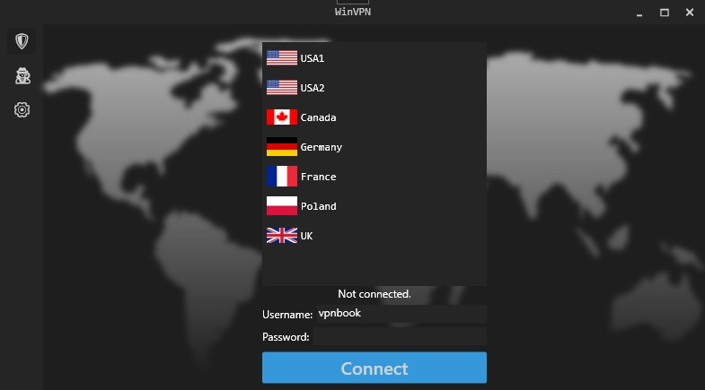

# WinVPN

WinVPN is a small multipurpose application for Windows that allows you to connect to a VPN server or connect to Tor services by launching the Tor Browser if it is installed on the system. For the VPN, it uses the services of [VPNBook](https://www.vpnbook.com/). The application is written in C# and uses WPF for the graphical interface.

## Features

-   Connect to a VPN server using VPNBook services.
-   Connect to Tor services by launching the Tor Browser if it is installed on the system.

## Requirements

-   Windows 10 or later (64-bit)
-   [.NET 8 Runtime](https://dotnet.microsoft.com/download/dotnet/8.0)

## Installation

1. Download the latest version of the application from the [Releases](https://github.com/dan-koller/winvpn/releases)
2. Extract the contents of the ZIP file to a folder of your choice
3. Run `WinVPN.exe`

## License

This project is licensed under the MIT License - see the [LICENSE](LICENSE) file for details.

## Acknowledgments

The idea for this application comes from [Payload](https://www.youtube.com/@_buffer). Thank you for the inspiration!
